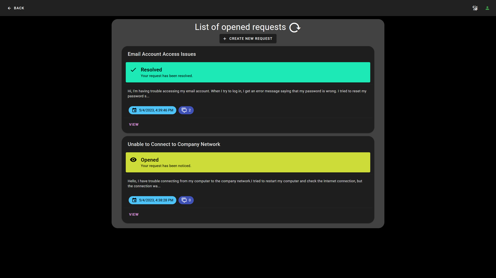

# Connect Task System 

Connect Task System is a web application that solves the difficulty in communication between organizations and customers. It allows organizations that use task systems to connect to customers.

Customers can create new requests via this web application. The web application then creates new task in the connected task system.
Employees can communicate with the customers via the task system's comments.

Customers can log in into the application using one-time code that will be sent to user's email. They can create requests, see status of each request and send messages to the organization. The users are also allowed to resolve or rejected proposed solutions to their requests.

The web application is designed to be customizable and expandable - any task systems with an API can be connected to this application, such as Jira or Asana.

It was created as part of bachelor thesis in _Czech Technical University in Prague_.



Nymsa Lukáš. _Requests Status Overview Web Application based on Existing Task_
System. Bachelor’s thesis. Czech Technical University in Prague, Faculty of Information Technology, 2023.

## :bulb: Status
- 1.0.0
  - YouTrack support
  - Authentication
  - Creating new requests
  - Sending messages
  - Responsiveness for desktop and mobile devices
  - Light and dark mode toggle
  - Changing the status of tasks to:
    - Reopened
    - Resolved
    - Rejected


## :computer: Technologies
- Front-end application: TypeScript, Vue.js 3, Vuex, Vue Router
- Back-end application: C#, ASP.NET framework 6.0

## :file_folder: Configuration

### Front-end
Front-end application needs to have back-end's URL set in the configuration.

1. create new file _.env.local_
2. copy contents of _.env_ to the newly created file
3. past back-end's url to the _VITE_API_URL_

### Back-end
Before starting up the ASP.NET project, configuration file needs to be set.

1. create new file _appsettings.local.json_
2. copy contents of _example.appsettings.json_ to the newly created file
3. setup the connection as is described below

#### Explanation of values in the configuration file for YouTrack:

- Url
  - url of YouTrack server's API
  - see more [here](https://www.jetbrains.com/help/youtrack/devportal/api-url-and-endpoints.html)
- Token
  - requires permanent token of a user
  - How to create: YouTrack, Users -> choose user -> Account Security -> New Token...
  - see more [here](https://www.jetbrains.com/help/youtrack/server/Manage-Permanent-Token.html)
- ProjectIDs
  - IDs of projects that you want the app to access and read from
- MainProjectId
  - ID of project
  - all new created requests will be created in this project
- UserField
  - custom field's name
  - this field contains user's email for each created request
  - How to create: Settings -> Custom Fields -> Add field to project
- ExpirationTimeMinutes
  - sets the validity of request-code and token in minutes
- States
  - mapping for naming states, in the _example.appsettings.json_ an example is provided
    - key contains the application's naming DO NOT CHANGE (unless you want to)
    - value contains the task system's naming
- MailSettings
  - requires mail host, port, username and password
- Testing
  - these values are only used for testing purposes, delete it or keep it empty if not wanted
  - used in postman collection available in this repository _postman-tests.json_


## :wrench: Installation
### Front-end
Requires npm installed, see more [here](https://docs.npmjs.com/downloading-and-installing-node-js-and-npm).

### Back-end
Requires ASP.NET 6.0 installed, available from [here](https://learn.microsoft.com/en-us/dotnet/core/install/).

## :arrow_forward: How to run

### Front-end
```
npm install

npm run dev
```

### Back-end

```
dotnet run
```

## Testing
Postman collection of tests is located in tests/ConnectTaskSystemTest.postman_collection.json